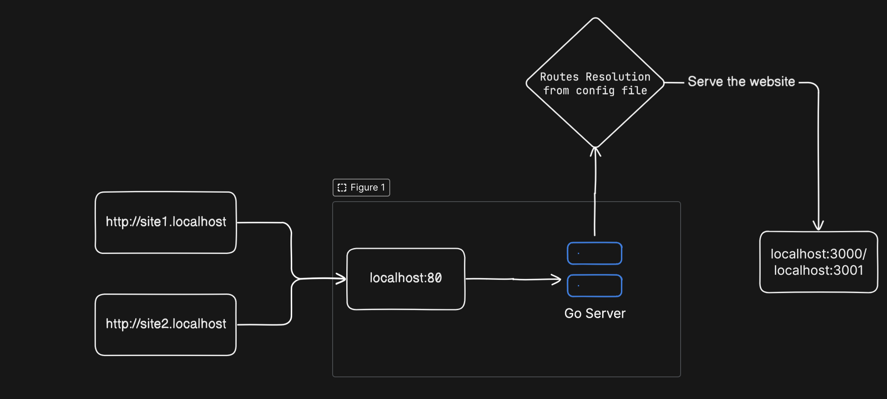

### Go Reverse Proxy in Docker for Local Development

This project is a Go-based reverse proxy that allows local development with custom subdomains pointing to specific ports on your local machine. Using Docker, this proxy server dynamically routes requests to different ports based on subdomain configurations.

#### Steps to use:
1. Pull the image. `docker pull nickbhatt/go-proxy-server:1.0.0`
2. Create custom routes file. 
```json
# routes.json
{
  "routes": {
    "site1.localhost": "3000",
    "site2.localhost": "3001"
  }
}
``` 
3. Run docker container. `docker run -p 80:80 -v $(pwd)/routes.json:/app/routes.json nickbhatt/go-proxy-server:1.0.0`

#### Working


#### Local DNS Resolution
For local development, the localhost domain is mapped to 127.0.0.1, directing traffic to your machine. The proxy server in Docker listens on port 80 of 127.0.0.1 and routes based on subdomains defined in routes.json. Make sure the site1.localhost and site2.localhost subdomains are properly configured (e.g., using host.docker.internal to access services on the host if needed).